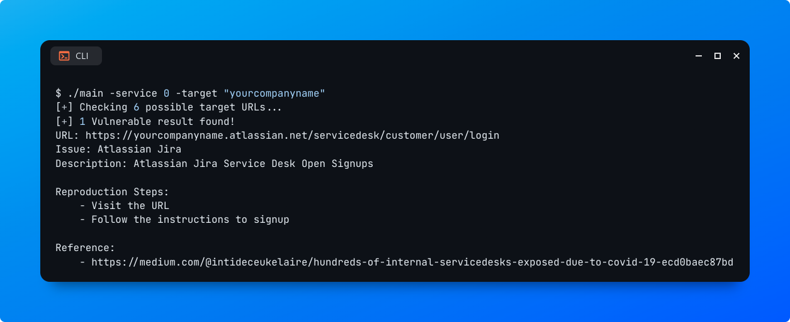

# project1-scanner

Scanner for [Project1](#)

# Project Name (een aantal suggesties):
- Service Scanner / ServiceScan
- Service Attacker / ServiceAttack
- Active Service

# Installation

1. Clone this repository
```bash
$ git clone {GH_REPO}
```

2. Run the precompiled binary (see [usage](#Usage) for more information)

## From source:
Make sure you have the latest version of Golang installed. To verify your installation, run:

```bash
$ go version
```

Output:

```bash
go version go1.21.1 linux/amd64
```

1. Compile your own binary from source
```bash
$ go build main.go -o main
```

2. Add or move the binary to a folder in your $PATH

# Usage
```
Usage: ./main <subcommand> [options]

Available subcommands:
	permutations  Print out possible organization names for a company name

Usage of ./main:
	-headers string
			Specify request headers to send with requests (separate each header with a double semi-colon: "User-Agent: xyz;; Cookies: xyz...;;"
	-passive-only
			Only check for existing instances (don't check for misconfigurations)
	-service string
			Specify the service ID you'd like to check for: "0" for Atlassian Jira Service Desk. Wildcards are also accepted to check for all services at once. (default "0")
	-services
			Print all services with their associated IDs
	-target string
			Specify your target domain name or company name: Intigriti
	-timeout float
			Specify a timeout for each request sent in seconds (default: "7.0"). (default 7)


Usage of permutations:
	-target string
			Specify your target domain name or company name: Intigriti
```

## Examples

```bash
$ ./main -target intigriti -service 0
```



# Services
Get a list of supported services:

```bash
$ ./main -services
1 Service(s) loaded!
| ID | Service                               
|----|---------------------------------------
| 0  | Atlassian Jira Service Desk
...
```

# Templates
You can easily create and add your own templates to services.json file:

```json
{
	"id":									0,
	"baseURL":						"{BASE_URL}",
	"path":								"{PATH}",
	"service":						"{SERVICE_NAME}",
	"description":				"{DESCRIPTION}",
	"reproductionSteps":	[
													"{STEP_1}",
													"{STEP_2}",
													"..."
	],
	"passive":						[
													"{KEYWORD_1}",
													"{KEYWORD_2}",
													"..."
	],
	"active":							[
													"{KEYWORD_1}",
													"{KEYWORD_2}",
													"..."
	],
	"references":					[
													"{REFERENCE_1}",
													"{REFERENCE_2}",
													"..."
	]
}
```

# Contributions
Learn more on how to contribute to the project

# License
Project's License

