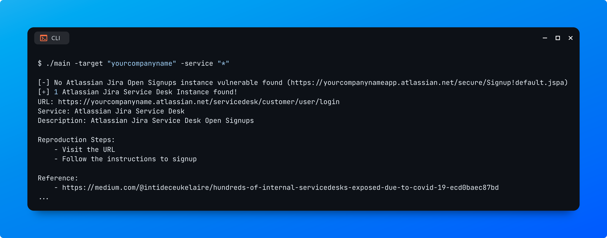
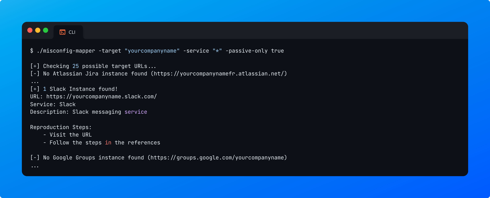
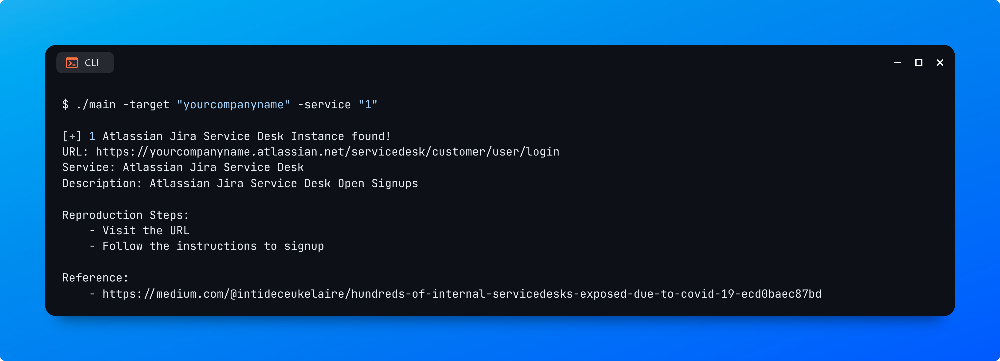
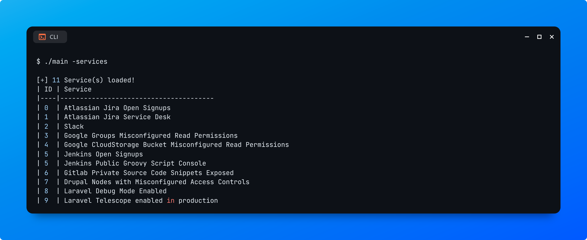

# ServiceScanner

A list of with the most common misconfigurations among popular services used by bug bounty targets and online (software) companies!

Curated by @INTIGRITI for the community!


# Project Name (een aantal suggesties):
- Service Scanner / ServiceScan
- Service Attacker / ServiceAttack
- Active Service

# CLI Tool

_**Project 1**_ has a dedicated open-source CLI tool written in Golang to help you automate the testing of most misconfigurations found on covered services.\
\
It is capable of enumerating dedicated instances of services that your company may use and also perform passive & active tests to check for certain misconfigurations at scale!\
\
The tool is based on templates and is versatile. New services can be easily added by adding them to the `services.json` file.

### Features:

* The CLI tool is based on templates provided in the `services.json` file. You can add as many as you want. See [_Templates section_](cli-tool.md#templates) for more information on how to add a template.
* If you provide a company name, the tool will automatically generate permutations based on your provided keyword and try to find any service that is used.
* You can optionally choose to only enumerate services and not perform any active tests (see more on [_Usage section_](cli-tool.md#usage)).

### Installation:

1. Clone this repository:

```bash
$ git clone {GH_REPO}
```

2. Run the pre-compiled binary (see [usage](cli-tool.md#usage) for more information).

```bash
$ ./main -help
```

#### From source:

In case you'd want to build your own version from source, make sure you have the latest version of Golang installed. To verify your installation, run:

```bash
$ go version
  go version go1.21.1 linux/amd64
```

1. Next, compile your own binary from source:

<pre class="language-bash"><code class="lang-bash"><strong>$ go build main.go -o main
</strong></code></pre>

2. Finally, add or move the binary to a folder in your `$PATH` (optional)

### Usage:

**Example 1:** Perform active tests to enumerate all misconfigured third-party services

```basic
$ ./main -target "yourcompanyname" -service "*"
```

<figure><figcaption></figcaption></figure>

**Example 2:** Only perform passive tests to enumerate all third-party services

```bash
$ ./main -target "yourcompanyname" -service "*" -passive-only
```

<figure><figcaption></figcaption></figure>

**Example 3:** Only test for 1 specific service

```bash
$ ./main -target "yourcompanyname" -service "1"
```

<figure><figcaption></figcaption></figure>

**Example 4:** Print out all loaded services

```bash
$ ./main -services
```

<figure><figcaption></figcaption></figure>

You can additionally also pass request headers using the `-headers` flag to comply with any request requirements (separate each header using a **double semi-colon**):

```
-headers "User-Agent: xyz;; Cookies: session=eyJ...;;"
```

```
Usage of ./main:
  -headers string
    	Specify request headers to send with requests (separate each header with a double semi-colon: "User-Agent: xyz;; Cookies: xyz...;;"
  -passive-only
    	Only check for existing instances (don't check for misconfigurations). Default: "false"
  -permutations
    	Enable permutations and look for several other keywords of your target. Default: "true" (default true)
  -service string
    	Specify the service ID you'd like to check for: "0" for Atlassian Jira Open Signups. Wildcards are also accepted to check for all services. (default "0")
  -services
    	Print all services with their associated IDs
  -target string
    	Specify your target domain name or company/organization name: "intigriti.com" or "intigriti"
  -timeout float
    	Specify a timeout for each request sent in seconds (default: "7.0"). (default 7)
```

### Templates:

You can easily define more templates to scan for. Templates are in a structed JSON object and read from `services.json` \
\
To define more services, edit the services.json file and separate each misconfiguration in your services.json file.

```json
{
	"id":			0,
	"baseURL":		"{BASE_URL}",
	"path":			"{PATH}",
	"service":		"{SERVICE_NAME}",
	"description":		"{DESCRIPTION}",
	"reproductionSteps":	[
		"{STEP_1}", 
		"{STEP_2}", 
		...
	],
	"passive":		[
		"{KEYWORD_1}",
		"{KEYWORD_2}",
		...
	],
	"active":		[
		"{KEYWORD_1}",
		"{KEYWORD_2}",
		...
	],
	"references":		[
		"{REFERENCE_1}",
		"{REFERENCE_2}",
		...
	]
}
```

#### ID:

**Type:** number\
\
`id` field is used to identify the service when the `-service` flag is passed. This should be a numerical value that follows the sequence of previous IDs.

**BaseURL:**

**Type:** string

`baseURL` field is used to locate the third-party service, this is the field used to check if the third-party instance exists for example.

#### Additional Note:
The CLI tool can auto-detect and replace the **"{TARGET}"** template variable with the target provided using the target flag.\
\
Example: https://{TARGET}.example.com will allow the tool to look for:

* https://yourcompanyname.example.com
* https://yourcompanyname-app.example.com
* https://yourcompanyname-eu.example.com
* ...


#### **Path:**

**Type:** string

The `path` field is used to check whether the service is vulnerable or not by observing the response.

##### Additional Note:
The CLI tool can auto-detect and replace the **"{TARGET}"** template variable with the target provided using the target flag.\
\
Example: /app/{TARGET} will allow the tool to look for:

* https://example.com/app/yourcompanyname
* https://example.com/app/yourcompanyname-app
* https://example.com/app/yourcompanyname-eu
* ...


#### **Service:**

**Type:** string

The `service` field is used to display the service name in the CLI output results to easily identify what service is currently being scanned for.


#### **Description:**

**Type:** string

`description` field is used to display the service description in the CLI output results once a service has been enumerated or identified and validated to be vulnerable.


#### **Reproduction Steps:**

**Type:** string array

The `reproductionSteps` field is used to report back on how to reproduce the found misconfiguration. These steps are derived from this documentation.

##### Additional Note:
Each step should be in a separate array entry. You can specify as many steps as you'd like to.


#### **Passive:**

**Type:** string array

The `passive` field is used to enumerate & validate the existence of a third-party service for your target. Make sure to define strict keywords to minimize the chances of false positive results.


#### **Active:**

**Type:** string array

The `active` field is used to validate the existence of a misconfigured third-party service for your target. Make sure to define strict keywords to minimize the chances of false positive results.


#### **References:**

**Type:** string array

`references` field is used to provide references once a service has been enumerated or found to be misconfigured. These references are derived from this documentation.

##### Additional Note:
Each reference should be in a separate array entry. You can specify as many references as you'd like to.


# Contributions
Learn more on how to contribute to the project.

# License
This project is licensed and available under the {LICENSE} license.
