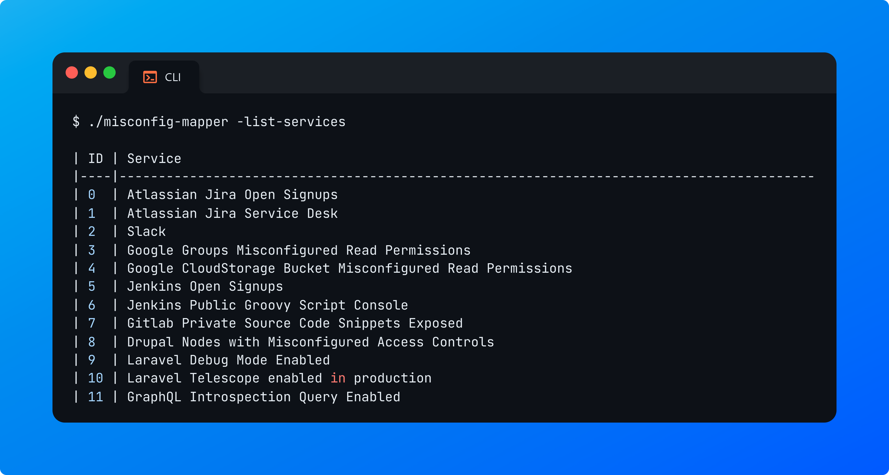

# Misconfig Mapper

Misconfig Mapper is a project by Intigriti for the community to help you find, detect and resolve common security misconfigurations in various popular services, technologies and SaaS-based solutions that your targets use!


# CLI Tool

**Misconfig Mapper** has a [dedicated open-source CLI tool](https://github.com/intigriti/misconfig-mapper) written in Golang to help you automate the testing of most misconfigurations found on covered services.\
\
It can identify and enumerate instances of services used by your company, and perform detection and misconfiguration checks at scale! By supplying a template with detection fingerprints and misconfiguration check fingerprints, the tool can quickly and accurately identify potential security risks in popular third-party software and services!\
\
The tool is based on templates and is versatile. New services can be easily added by adding them to the `services.json` file.

# Features

-   The CLI tool is based on templates defined in the `services.json` file. You can add as many as you want. See [_Templates section_](cli-tool.md#templates) for more information on how to add a template.
-   If you provide a company name, the tool will automatically generate permutations based on the keyword you provided and try to find any matching services.
-   You can also optionally select to only detect the presence of services without performing any misconfiguration checks (see more on [_Usage section_](cli-tool.md#usage)).

# Installation

To install Misconfig Mapper, you can clone the repository and compile the code from source or [download the latest release](https://github.com/intigriti/misconfig-mapper/releases).

### From source

If you want to build your own instance from source, ensure you have the latest version of Golang installed. To verify your installation, run:

```bash
$ go version
  go version go1.21.5 linux/amd64
```

1. Clone this repository:

```bash
$ git clone https://github.com/intigriti/misconfig-mapper.git
```

2. Next, compile your binary from source:

```bash
$ go build -o misconfig-mapper
```

3. Finally, add or move the binary to a folder in your `$PATH` (optional)

### CLI Auto-Completion

In case you would like to enable autocompletions for Misconfig Mapper, we support both Bash and ZSH.

#### Bash

```bash
#!/bin/bash
_misconfig_mapper_autocomplete()
{
    local cur prev opts
    COMPREPLY=()
    cur="${COMP_WORDS[COMP_CWORD]}"
    prev="${COMP_WORDS[COMP_CWORD-1]}"
    opts="-target -service -permutations -skip-misconfiguration-checks -list-services -max-redirects -headers -delay -timeout -verbose"

    if [[ ${cur} == -* ]] ; then
        COMPREPLY=( $(compgen -W "${opts}" -- ${cur}) )
        return 0
    fi
}

complete -F _misconfig_mapper_autocomplete misconfig-mapper
```

#### ZSH (OhMyZsh)

```zsh
#!/bin/zsh
#compdef misconfig-mapper

_auto_completion_misconfig_mapper() {
    local -a options=("-target" "-service" "-permutations" "-skip-misconfiguration-checks" "-list-services" "-max-redirects" "-headers" "-delay" "-timeout" "-verbose")

    _arguments \
        '*: :->args' \
        "*: :(${(j:|:)options})"

    case $state in
        (args)
            # Handle arguments completion here
            ;;
        (*)
            # Handle options completion here
            compadd -a options
            ;;
    esac
}

_auto_completion_misconfig_mapper "$@"
```

> [!IMPORTANT]
> Make sure to save this file as `_auto_completion_misconfig_mapper` under your `$fpath`.
> Afterwards, you will have to initialize the completion system with:
>
> ```
> autoload -U compinit
> compinit
> ```

# Usage

**Example 1:** Perform a scan to enumerate all misconfigured third-party services

```basic
$ ./misconfig-mapper -target "yourcompanyname" -service 1 -delay 1000
```


**Example 2:** Perform a detection-only scan to enumerate all third-party services (without checking for any misconfigurations)

```bash
$ ./misconfig-mapper -target "yourcompanyname" -service 1 -skip-misconfiguration-checks true
```


**Example 3:** Only test for one specific service (by ID or name)

```bash
$ ./misconfig-mapper -target "yourcompanyname" -service 1
```

```bash
$ ./misconfig-mapper -target "yourcompanyname" -service "drupal"
```


**Example 4:** Print out all loaded services

```bash
$ ./misconfig-mapper -list-services
```



Additionally, you can pass request headers using the `-headers` flag to comply with any request requirements (separate each header using a **double semi-colon**):

```
-headers "User-Agent: xyz;; Cookie: session=eyJ...;;"
```

```
Usage of ./misconfig-mapper:
  -delay int
    	Specify a delay between each request sent in milliseconds to enforce a rate limit.
  -headers string
    	Specify request headers to send with requests (separate each header with a double semi-colon: "User-Agent: xyz;; Cookie: xyz...;;"
  -list-services
    	Print all services with their associated IDs
  -max-redirects int
    	Specify the max amount of redirects to follow. (default 3)
  -permutations string
    	Enable permutations and look for several other keywords of your target. (default "true")
  -service string
    	Specify the service ID you'd like to check for: "0" for Atlassian Jira Open Signups. Wildcards are also accepted to check for all services. (default "0")
  -skip-misconfiguration-checks string
    	Only check for existing instances (and skip checks for potential security misconfigurations).
  -target string
    	Specify your target domain name or company/organization name: "intigriti.com" or "intigriti" (files are also accepted)
  -timeout int
    	Specify a timeout for each request sent in milliseconds. (default 7000)
  -verbose
    	Print verbose messages
```

# Templates

You can easily define more templates to scan for. Templates are in a structured JSON object and read from `services.json`\
\
To define more services, edit the services.json file and separate each misconfiguration in your `services.json` file.

An example template definition schema is available [here](./assets/template-schema.json).

## Template Type Definitions

### **ID**

**Type:** number\
\
The `id` field is used to identify the service when the `-service` flag is provided. It should be a numerical value that follows the sequence of previous IDs.

## Request

### **Method**

**Type:** string

The `method` field is used to provide a HTTP method.

### **BaseURL**

**Type:** string

The `baseURL` field is used to locate the third-party service, if it exists.

> [!TIP]
> The CLI tool can auto-detect and replace the **"{TARGET}"** template variable with the target provided using the target flag.\
> \
> Example: https://{TARGET}.example.com will allow the tool to look for:
>
> -   https://yourcompanyname.example.com
> -   https://yourcompanyname-app.example.com
> -   https://yourcompanyname-eu.example.com
> -   ...

### **Path**

**Type:** string

The `path` field checks whether the service is vulnerable by observing the response.

> [!TIP]
> The CLI tool can auto-detect and replace the **"{TARGET}"** template variable with the target provided using the target flag.\
> \
> Example: /app/{TARGET} will allow the tool to look for:
>
> -   https://example.com/app/yourcompanyname
> -   https://example.com/app/yourcompanyname-app
> -   https://example.com/app/yourcompanyname-eu
> -   ...

### **Headers**

**Type:** object array

The `headers` field is used to supply any required request headers.

### **Body**

**Type:** string | null

The `body` field is used to supply a raw request body.

> [!NOTE]
> Set the request body to **null** if there's no need to send a request body.

## Response

### **StatusCode**

**Type:** int

The `statusCode` field is used to validate the matching response status code and further minimize the chances of false positive results.

### **Detection Fingerprints**

**Type:** string array

The `detectionFingerprints` field supports enumeration & validation of a third-party service for your target. These fingerprints are used to mark the detection of a service or instance. Make sure to define strict regex patterns or keywords to minimize the chances of false positive results.

> [!TIP]
> Regex patterns are supported!

### **Fingerprints**

**Type:** string array

The `fingerprints` field is used to validate the existence of a misconfigured third-party service for your target. Make sure to define strict regex patterns or keywords to minimize the chances of false positive results.

> [!TIP]
> Regex patterns are supported!

## Metadata

### **Service**

**Type:** string

The `service` field is used to display the service name in the CLI output results to visually confirm which service is currently being scanned.

### **Description**

**Type:** string

The `description` field displays the service description in the CLI output once a service has been enumerated or identified and confirmed vulnerable.

### **Reproduction Steps**

**Type:** string array

The `reproductionSteps` field reports back on how to reproduce the found misconfiguration. These steps are derived from this documentation.

> [!NOTE]
> Each step should be in a separate array entry. You can specify as many steps as you'd like to.

### **References**

**Type:** string array

The' references' field documents enumerated and misconfigured services. These references are derived from this documentation.

> [!NOTE]
> Each reference should be in a separate array entry. You can specify as many references as you'd like to.

# Contributions

Misconfig Mapper is open-source and made for the community! We encourage you to contribute to the project! Please see the [Contributing guideline](CONTRIBUTING.md) on how to contribute and further improve Misconfig Mapper!

# License

This project is licensed and available under the [MIT License](LICENSE.md).
